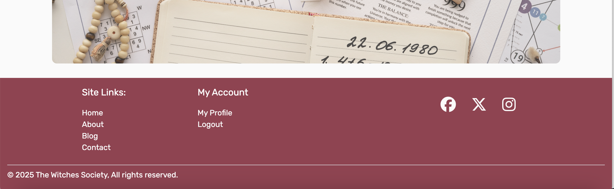

# The Witches Society

[Live site](https://witches-society-e36df8ff45ed.herokuapp.com/)


The Witches Society is an online submission blog page where users can submit their own spells to a collaborative Grimoire. The site provides a fun community space where like minded individuals can come together and share their spell knowledge. All users are free to browse the blog. Users may create a user profile account if they wish to contribute their own spells to the blog.

## User Experience (UX)

After researching into similar existing witch themed sites I decided to opt for a simple, feminine, monochomatic colour palette as I found most sites to be overwhelmingly dark in theme.


## Fonts

- [Irish Grover](https://fonts.google.com/specimen/Irish+Grover/tester?categoryFilters=Appearance:%2FTheme%2FWacky) was used for the site Logo.
- [Rubik](https://fonts.google.com/specimen/Rubik) was used for the site's main content.

## User stories

User stories can be found [here](https://github.com/users/Jahooli4/projects/4/views/1) via my gitHub project.

## Structure Plane

### Home page:
- Site logo
- Navigation bar with links (Left side)
- Navigation bar with login/logout and profile/register links (right side)
- Hero image carousel featuring moon landscape images
- Welcome message with brief site description
- Footer section with links to social media

### About page:
- Navigation bar with logo/links
- Information about the purpose and function of the site hidden behind visually appealing interactive flip cards
- Footer

### Blog page: 
- Navigation bar with logo/links
- List of spell submission blog posts in chronological order, most recent first
- Posts are just previews, showing feature image, title, author and date posted
- Pagination: allows users to navigate between pages of posts
- Footer

### Post detail page
- Full blog post including content is displayed
- If the current logged in user is also the post author then the edit/delete option buttons will be visible

### Register page
- Sign up form with required fields for users to create an account
- Default profile image is used if user does not upload their own

### Profile page
- Shows user's account information
- Update button that reveals a profile update form should users wish to edit their information

### Submit a spell page
- Only accessible to logged in users
- Form allows users to submit spell blog posts

## Existing Features
### Site pages:
#### Home page
The landing page for the Witches Society is simple and clean with intuitive navigation. A hero slideshow offers a more engaging option than a single image.


### Footer section
The footer section contains all relevant site and social media links. Account links are displayed for logged in users.



### About page
The about page contains information about the site owners, the site's purpose, and how to use it. The information text is neatly concealed behind flip cards with a tarot card front to keep the visual design on brand.


### Spell blog page
The blog page is organised with each blog post displayed featuring the post image, title, author and date. The posts are displayed in orde rof date posted, with the most recent at the top.


### Pagination
Both blog and user post pages are paginated by 6, when the post count eceeds this numbered buttons are displayed at the bottom of the page to make navigation user friendly.


### Post detail
The post detail displays the full blog post content and photo, including a small thumbnail of the author's profile picture.


### Post edit
The edit/delete buttons are only visible to the logged in post author.


### Post Delete
Double checks the user is sure they want to delete their post to avoid accidental one click deletes.


### User posts page
If a user clicks on an author's username on any page then they will be taken to a page displaying a list of posts by that author.


### Spell submition page
The spell submission page features a form that allows users to ubmit their own spell posts to the blog. If users neglect to upload a photo then a default header image is automatically added instead.


### Register page
Provides a form for users to fill out should they wish to create an account and access logged in user features.


### Profile page
The profile page displays the user's information in a clean and organised way. An 'edit profile' button has been provided should users wish to update any of their details. When clicked it reveals the update profile form.


### Edit profile form
Contains all the relevent fields a user may wish to alter, including their profile picture.


### Logout
Alerts users that they have successfully logged out.


## Future features

### Front end admin panel
- Would allow admin users to access user profiles and investigate any issues they may have.
- Admin users would be able to delete any user's posts, not just the ones they have created.

### Password reset
- A feature to allow users to reset their passwords, users would be sent an email with a link.
- This is a fairly essential feature to prevent users being locked out of their accounts without having to contact admin to resolve the issue.

### Blog page
- Once the blog is established and has a lot more posts it would be handy to be able to filter the posts by theme.

## Testing

### User testing
| Feature being tested:| Steps                                | Expected outcome  | Pass/Fail |
|:---------------------|:-------------------------------------|:------------------|-----|
| Navigation - Logo | Click the logo on every page. | The logo should link the user back to the homepage, should be active on every page. | PASS |
| Home page - UX | Read through the text. | The site purpose should be obvious to any user from reading the front page. | PASS |
| About page - | Hover over each flip card. |Each flip tarot card should turn to reveal the text behind. | PASS |
| About page - |Hover over each flip card. | The text on the tarot cards should not spill over the parameter of the container on any device size. | PASS |
| Blog page/User post - | Load the blog/user posts page. | Posts should display in order of date. | PASS |
| User post page - | Click on the username of an author on any post. | Link should take you to a page with a list of posts by that user. | PASS |
| Pagination - | Click through pagination buttons. | Buttons should take you to the relevant page. | PASS |
| Footer - Social media icons | Click each one, test on each page. | Each link should change colour when hovered over and open in a new tab when clicked. | PASS |
| Submit a spell page - | Fill out the spell submission page | Post is successfully created and success message displayed | PASS|
| Submit a spell page - | Submit form without header image. | Post is successfully created and default header image applied. | PASS|
| Post detail - | Load an idividual post. | Edit/delete buttons only visible to the post author. | PASS|
| Edit post button - | Alter post fields. | Post is successfully updated and success message displayed | PASS|
| Delete post button - | Delete post. | Post is successfully deleted and confirmation message displayed | PASS|
| Register page - | Fill out the registration form. | New profile should be successfully created. | PASS |
| Deafault profile image - | Create new account without a profile picture. | Account should be created with default profile image. | PASS |
| Login page - | Login with invalid user details. | Access denied. | PASS |
| Login page - | Login with valid user details. | Access granted and redirected to the home page. | PASS |
| Profile page - | Load profile page as a logged in user. | User info is displayed correctly. | PASS| 
| Profile page - | Click 'edit profile button. | Edit profile form is displayed. | PASS| 
| Profile page - | Fill out edit profile form and submit. | User info is updated correctly. | PASS| 
| Logout page - | Click logout link. | User is logged out correctly and message displays confirming this. | PASS| 
| Responsiveness - UX | Resize site for all device sizes. | Check that images/text/other elements resize as expected, text should be readable and elements should all be visible and not overlap randomly. Repeat for every page. | PASS|

## Lighthouse testing

### Home page (minor performance issues):


### About page:


### Blog page:


### Post form page:


### Register page:


### Login page:


### Profile page:


## HTML validator

HTML validator used: [HTML validator](https://validator.w3.org/nu/)

### Home page:


### About page:


### Blog page:


### Profile page:


### Register page:


### Login page:


### Logout page:


### Post detail page:


### Post form page:


### User posts page:


## CSS Testing

CSS validator used: [CSS validator](https://jigsaw.w3.org/css-validator/)


## JS Testing:

JS validator used: [JS validator](https://jshint.com/)

### Home page:


### Profile page:


## Python testing
 Python validator used [Python validator](https://pep8ci.herokuapp.com/)

### Validation for witches_society app:
| File:     | Screenshot:                       | Notes:  | 
|:----------|:--------------------------------------------------------------------------|:--------|
| asgi.py   |  | No errors |
| settings.py |  | No errors |
| urls.py |  | No errors |
| wsgi.py |  | No errors |

### Validation for website app:
| File:     | Screenshot:                       | Notes:  | 
|:----------|:--------------------------------------------------------------------------|:--------|
| admin.py  |  | No errors |
| apps.py |  | No errors |
| models.py |  | No errors |
| urls.py |  | No errors |
| views.py |  | No errors |

### Validation for users app:
| File:     | Screenshot:                       | Notes:  | 
|:----------|:--------------------------------------------------------------------------|:--------|
| admin.py  |  | No errors |
| apps.py |  | No errors |
| forms.py |  | No errors |
| models.py |  | No errors |
| signals.py |  | No errors |
| urls.py |  | No errors |
| views.py |  | No errors |

## Browser testing
| Browser:     | Screenshot:                       | Notes:  | 
|:----------|:------------------------------------------------------|:--------|
| Chrome |  | No errors |
| Firefox |  | No errors |
| Safari |  | No errors |

## Bugs

### Incorrect post key:
<int:pk> post key number not as expected bc I had deleted posts previously. So url post/2 not post/1.


### Incorrect profile pictures showing
I had to use an if/else logic statement to ensure the correct image showed for the relevant profile.


### Terminal error preventing me from opening local port
A problem in the terminal said import wasn't being used so I deleted, env.py file was then not being imported so terminal error thrown. Replacing the code fixed the error.


No unfixed bugs I am aware of.

## Languages Used:
- HTML used for the main site content.
- CSS used for the main site design and layout.
- JavaScript used for user interaction on the site.
- Python used as the back-end programming language.

## Technologies Used:
- Git used for version control. (git add, git commit, git push)
- GitHub used for secure online code storage.
- Gitpod used as a cloud-based IDE for development.
- Bootstrap used as the front-end framework for modern responsiveness and pre-built components.
- Django used as the Python framework for the site.
- PostgreSQL used as the relational database management.
- ElephantSQL used as the Postgres database.
- Heroku used for hosting the deployed site.
- Cloudinary used for online static file storage.
- Pillow used for image processing
- Gunicorn used for WSGI server
- Coolor: I used coolor.co to generate a colour palette.
- Font Awesome: was used to import icons into the footer for the social media links.
- Google Fonts: was used to customise the fonts of the site.
- amiresponsive: used to generate screenshots at beginning of readme.

## Deployment
### ElephantSQL Database

This project uses [ElephantSQL](https://www.elephantsql.com) for the PostgreSQL Database.

To obtain your own Postgres Database, sign-up with your GitHub account, then follow these steps:
- Click **Create New Instance** to start a new database.
- Provide a name (this is commonly the name of the project: witches-society).
- Select the **Tiny Turtle (Free)** plan.
- You can leave the **Tags** blank.
- Select the **Region** and **Data Center** closest to you.
- Once created, click on the new database name, where you can view the database URL and Password.

### Cloudinary API

This project uses the [Cloudinary API](https://cloudinary.com) to store media assets online, due to the fact that Heroku doesn't persist this type of data.

To obtain your own Cloudinary API key, create an account and log in.
- For *Primary interest*, you can choose *Programmable Media for image and video API*.
- Optional: *edit your assigned cloud name to something more memorable*.
- On your Cloudinary Dashboard, you can copy your **API Environment Variable**.
- Be sure to remove the `CLOUDINARY_URL=` as part of the API **value**; this is the **key**.

### Heroku Deployment

This project uses [Heroku](https://www.heroku.com), a platform as a service (PaaS) that enables developers to build, run, and operate applications entirely in the cloud.

Deployment steps are as follows, after account setup:

- Select **New** in the top-right corner of your Heroku Dashboard, and select **Create new app** from the dropdown menu.
- Your app name must be unique, and then choose a region closest to you (EU or USA), and finally, select **Create App**.
- From the new app **Settings**, click **Reveal Config Vars**, and set your environment variables.

| Key | Value |
| --- | --- |
| `CLOUDINARY_URL` | user's own value |
| `DATABASE_URL` | user's own value |
| `DISABLE_COLLECTSTATIC` | 1 (*this is temporary, and can be removed for the final deployment*) |
| `SECRET_KEY` | user's own value |

Heroku needs two additional files in order to deploy properly.
- requirements.txt
- Procfile

You can install this project's **requirements** (where applicable) using:
- `pip3 install -r requirements.txt`

If you have your own packages that have been installed, then the requirements file needs updated using:
- `pip3 freeze --local > requirements.txt`

The **Procfile** can be created with the following command:
- `echo web: gunicorn app_name.wsgi > Procfile`
- *replace **app_name** with the name of your primary Django app name; the folder where settings.py is located*

For Heroku deployment, follow these steps to connect your own GitHub repository to the newly created app:

Either:
- Select **Automatic Deployment** from the Heroku app.

Or:
- In the Terminal/CLI, connect to Heroku using this command: `heroku login -i`
- Set the remote for Heroku: `heroku git:remote -a app_name` (replace *app_name* with your app name)
- After performing the standard Git `add`, `commit`, and `push` to GitHub, you can now type:
	- `git push heroku main`

The project should now be connected and deployed to Heroku!

### Local Deployment

This project can be cloned or forked in order to make a local copy on your own system.

For either method, you will need to install any applicable packages found within the *requirements.txt* file.
- `pip3 install -r requirements.txt`.

You will need to create a new file called `env.py` at the root-level,
and include the same environment variables listed above from the Heroku deployment steps.

Sample `env.py` file:

```python
import os

os.environ.setdefault("CLOUDINARY_URL", "user's own value")
os.environ.setdefault("DATABASE_URL", "user's own value")
os.environ.setdefault("SECRET_KEY", "user's own value")

# local environment only (do not include these in production/deployment!)
os.environ.setdefault("DEBUG", "True")
```

Once the project is cloned or forked, in order to run it locally, you'll need to follow these steps:
- Start the Django app: `python3 manage.py runserver`
- Stop the app once it's loaded: `CTRL+C` or `⌘+C` (Mac)
- Make any necessary migrations: `python3 manage.py makemigrations`
- Migrate the data to the database: `python3 manage.py migrate`
- Create a superuser: `python3 manage.py createsuperuser`
- Load fixtures (if applicable): `python3 manage.py loaddata file-name.json` (repeat for each file)
- Everything should be ready now, so run the Django app again: `python3 manage.py runserver`

#### Cloning

You can clone the repository by following these steps:

1. Go to the [GitHub repository](https://github.com/Jahooli4/witches-society) 
2. Locate the Code button above the list of files and click it 
3. Select if you prefer to clone using HTTPS, SSH, or GitHub CLI and click the copy button to copy the URL to your clipboard
4. Open Git Bash or Terminal
5. Change the current working directory to the one where you want the cloned directory
6. In your IDE Terminal, type the following command to clone my repository:
	- `git clone https://github.com/Jahooli4/witches-society`
7. Press Enter to create your local clone.

Alternatively, if using Gitpod, you can click below to create your own workspace using this repository.

[

Please note that in order to directly open the project in Gitpod, you need to have the browser extension installed.
A tutorial on how to do that can be found [here](https://www.gitpod.io/docs/configure/user-settings/browser-extension).

#### Forking

By forking the GitHub Repository, we make a copy of the original repository on our GitHub account to view and/or make changes without affecting the original owner's repository.
You can fork this repository by using the following steps:

1. Log in to GitHub and locate the [GitHub Repository](https://github.com/Jahooli4/witches-society)
2. At the top of the Repository (not top of page) just above the "Settings" Button on the menu, locate the "Fork" Button.
3. Once clicked, you should now have a copy of the original repository in your own GitHub account!

## Credits
### Image sources:
- [Hero image 1](https://www.freepik.com/free-photo/numerology-concept-still-life_38171481.htm#fromView=search&page=2&position=25&uuid=9cb45039-d237-4dd0-9813-9836eafbf9ba&new_detail=true&query=flatlay+spell)
- [Hero image 2](https://www.freepik.com/free-photo/top-view-ouija-board-candles_28694022.htm#fromView=search&page=2&position=10&uuid=c90625fa-07de-464a-b027-2b4016878d61&new_detail=true&query=flatlay+tarot)
- [Hero image 3](https://www.freepik.com/free-photo/top-view-esoteric-items-arrangement_29301134.htm#fromView=search&page=1&position=10&uuid=de4fe655-e659-4da1-acbf-2a525ab6eb47&new_detail=true&query=flatlay+spell)
- [tarot flip car 1](https://www.freepik.com/free-vector/hand-drawn-tarot-cards-illustration_38600065.htm#fromView=search&page=1&position=10&uuid=a2855599-f34c-47b2-8db8-521ecdb76283&new_detail=true&query=pink+tarot)
- [tarot flip car 2](https://www.freepik.com/free-vector/hand-drawn-tarot-cards-illustration_38600025.htm#fromView=search&page=1&position=0&uuid=a2855599-f34c-47b2-8db8-521ecdb76283&new_detail=true&query=pink+tarot)
- [tarot flip car 3](https://www.freepik.com/free-vector/hand-drawn-tarot-cards-illustration_38600023.htm#fromView=search&page=1&position=2&uuid=a2855599-f34c-47b2-8db8-521ecdb76283&new_detail=true&query=pink+tarot)

### Blog content sources:
- [Mage by moonlight](https://magebymoonlight.com/witch-hunts-antisemitism/)
- [Ouija](https://spiru.com/ouija-how-to-play-the-spirit-board/)
- [Llewellyn](https://www.llewellyn.com/journal/article/2835?srsltid=AfmBOoqeoBl8Um0opdDgI4xb4qhIyoshzR8KqlNbvw2VC2FPHj2OQ2rD)
- [Simply exist magickally](https://naturallymodernlife.com/making-incense-for-witchcraft/)
- [Simply exist magickally](https://naturallymodernlife.com/the-beaver-moon-witchy-ways-to-celebrate/)
- [True hauntings](https://truehauntings.com/trueghoststories/how-to-make-a-voodoo-doll)
- [Witch casket](https://witchcasket.co.uk/blog/)

### Tutorials and resources referenced to build site:
- Entire site: [Django documentation](https://docs.djangoproject.com/en/4.2/ref/templates/builtins/#ref-templates-builtins-tags)
- Entire site: [Youtube Blog tutorials](https://www.youtube.com/playlist?list=PL-osiE80TeTtoQCKZ03TU5fNfx2UY6U4p)
- Profile: [JS tutorials w3schools](https://www.w3schools.com/js/default.asp)
- Home page slideshow: [slideshow hot to: w3schools](https://www.w3schools.com/howto/howto_js_slideshow_gallery.asp)
- About page flip cards: [How to: flip cards w3schools](https://www.w3schools.com/howto/howto_css_flip_card.asp)
- Entire site (file structure): [My tutor's project for inspo and tips: Lewis Dillon](https://github.com/LewisMDillon/bushy-park-tennis-club-ld)
- Entire site: [Code institute walkthrough](https://learn.codeinstitute.net/courses/course-v1:CodeInstitute+FSD101N+2024/courseware/713441aba05441dfb3a7cf04f3268b3f/824fccecd0fe4e44871eeabcbf69d830/)
