## Testing

### User testing
| Feature being tested:| Steps                                | Expected outcome  | Pass/Fail |
|:---------------------|:-------------------------------------|:------------------|-----|
| Navigation - Logo | Click the logo on every page. | The logo should link the user back to the homepage, should be active on every page. | PASS |
| Home page - UX | Read through the text. | The site purpose should be obvious to any user from reading the front page. | PASS |
| About page - | Hover over each flip card. |Each flip tarot card should turn to reveal the text behind. | PASS |
| About page - |Hover over each flip card. | The text on the tarot cards should not spill over the parameter of the container on any device size. | PASS |
| Blog page/User post - | Load the blog/user posts page. | Posts should display in order of date. | PASS |
| User post page - | Click on the username of an author on any post. | Link should take you to a page with a list of posts by that user. | PASS |
| Pagination - | Click through pagination buttons. | Buttons should take you to the relevant page. | PASS |
| Footer - Social media icons | Click each one, test on each page. | Each link should change colour when hovered over and open in a new tab when clicked. | PASS |
| Submit a spell page - | Fill out the spell submission page | Post is successfully created and success message displayed | PASS|
| Submit a spell page - | Submit form without header image. | Post is successfully created and default header image applied. | PASS|
| Post detail - | Load an idividual post. | Edit/delete buttons only visible to the post author. | PASS|
| Edit post button - | Alter post fields. | Post is successfully updated and success message displayed | PASS|
| Delete post button - | Delete post. | Post is successfully deleted and confirmation message displayed | PASS|
| Register page - | Fill out the registration form. | New profile should be successfully created. | PASS |
| Deafault profile image - | Create new account without a profile picture. | Account should be created with default profile image. | PASS |
| Login page - | Login with invalid user details. | Access denied. | PASS |
| Login page - | Login with valid user details. | Access granted and redirected to the home page. | PASS |
| Profile page - | Load profile page as a logged in user. | User info is displayed correctly. | PASS| 
| Profile page - | Click 'edit profile button. | Edit profile form is displayed. | PASS| 
| Profile page - | Fill out edit profile form and submit. | User info is updated correctly. | PASS| 
| Logout page - | Click logout link. | User is logged out correctly and message displays confirming this. | PASS| 
| Responsiveness - UX | Resize site for all device sizes. | Check that images/text/other elements resize as expected, text should be readable and elements should all be visible and not overlap randomly. Repeat for every page. | PASS|

## Lighthouse testing

### Home page (minor performance issues):

### About page:
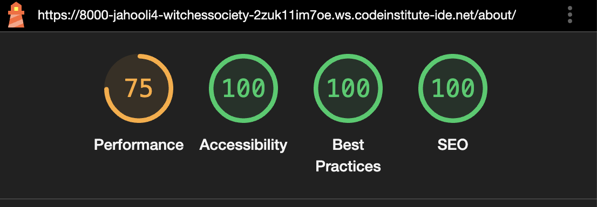

### Blog page:
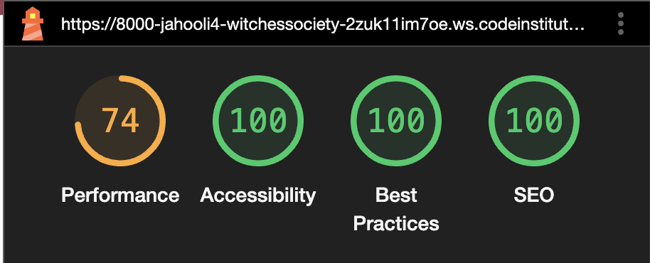

### Post form page:

### Register page:
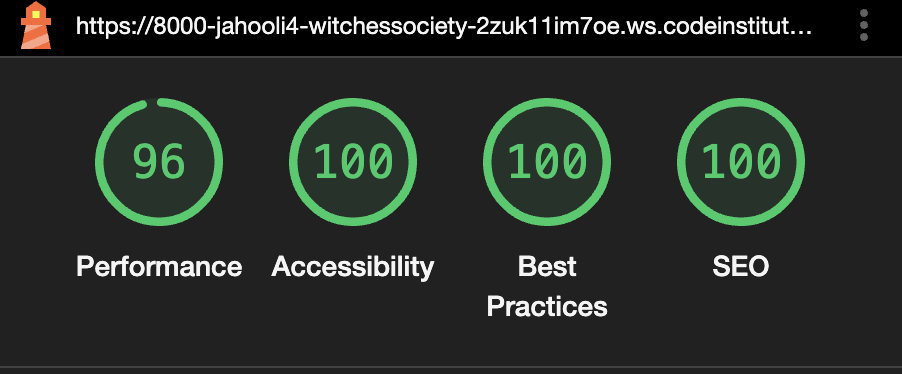

### Login page:
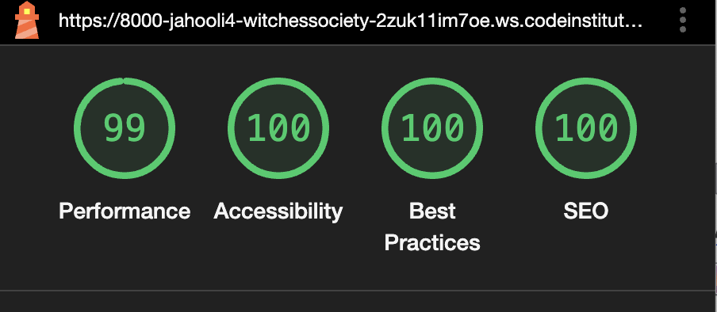

### Profile page:
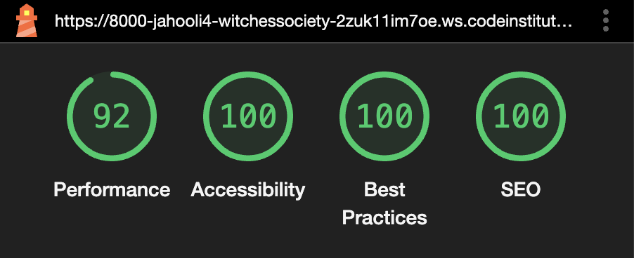

## HTML validator

HTML validator used: [HTML validator](https://validator.w3.org/nu/)

### Home page:

### About page:

### Blog page:

### Profile page:
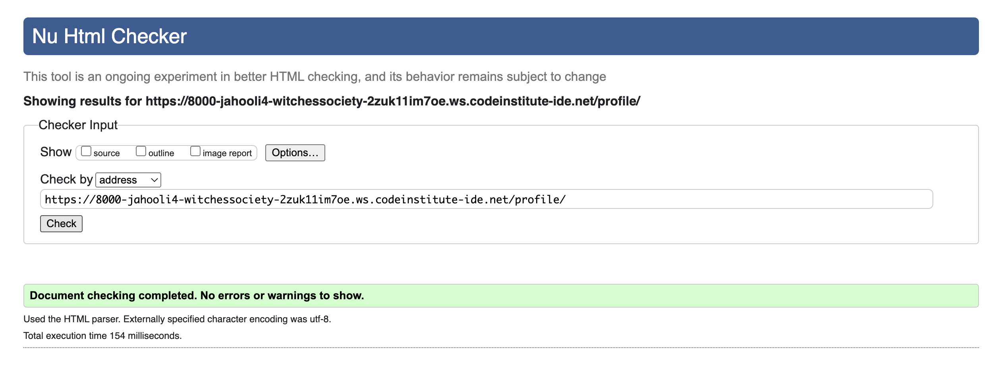

### Register page:
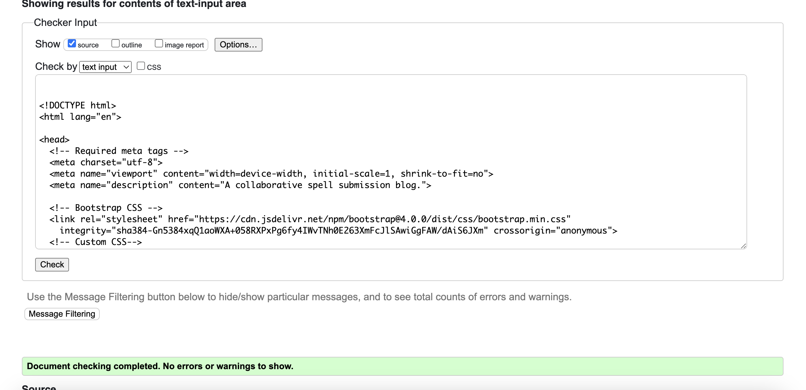

### Login page:
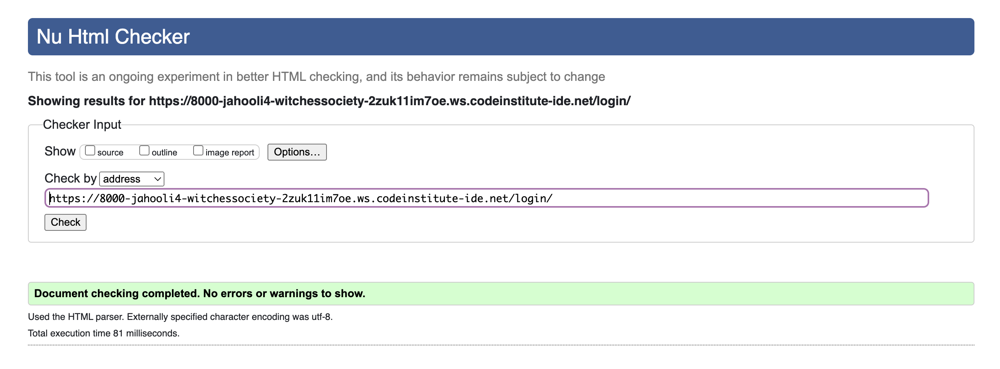

### Logout page:

### Post detail page:

### Post form page:

### User posts page:

## CSS Testing

CSS validator used: [CSS validator](https://jigsaw.w3.org/css-validator/)

## JS Testing:

JS validator used: [JS validator](https://jshint.com/)

### Home page:

### Profile page:
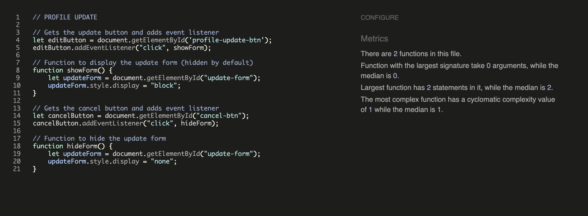

## Python testing
 Python validator used [Python validator](https://pep8ci.herokuapp.com/)

### Validation for witches_society app:
| File:     | Screenshot:                       | Notes:  | 
|:----------|:--------------------------------------------------------------------------|:--------|
| asgi.py   |  | No errors |
| settings.py | 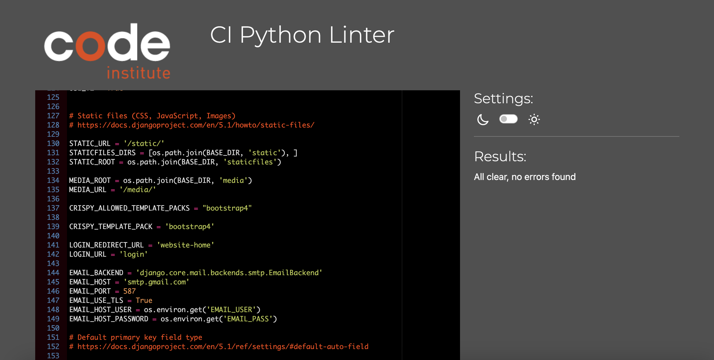 | No errors |
| urls.py | 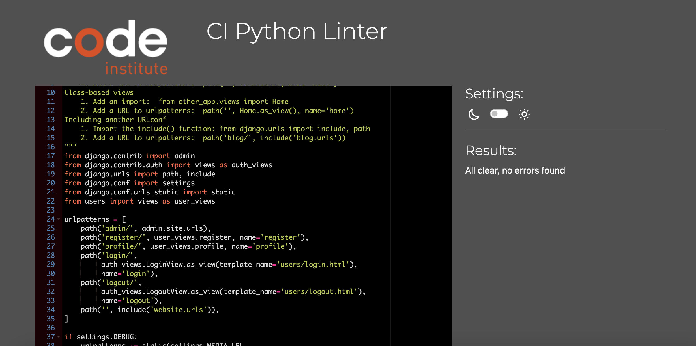 | No errors |
| wsgi.py | 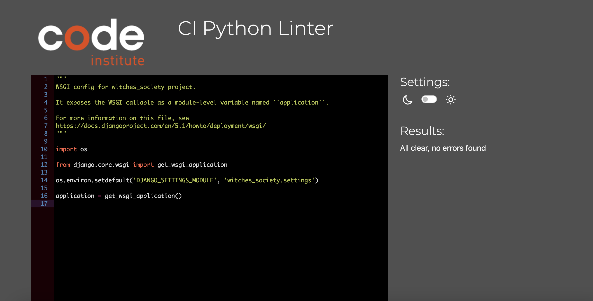 | No errors |

### Validation for website app:
| File:     | Screenshot:                       | Notes:  | 
|:----------|:--------------------------------------------------------------------------|:--------|
| admin.py  |  | No errors |
| apps.py | 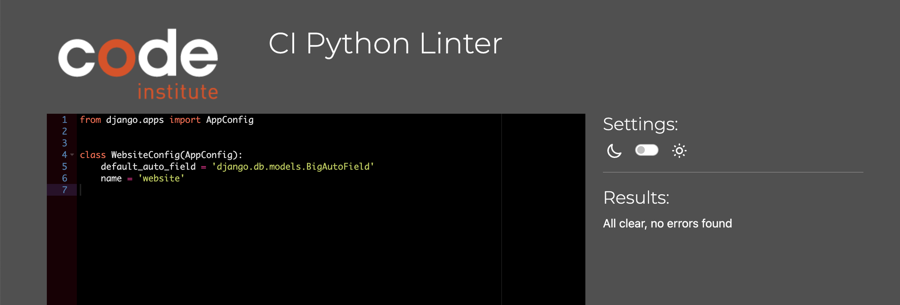 | No errors |
| models.py |  | No errors |
| urls.py | 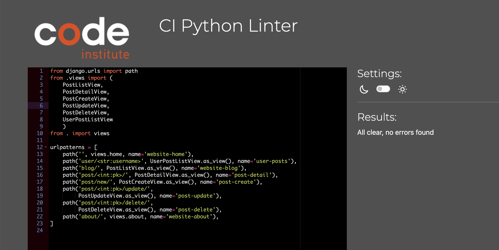 | No errors |
| views.py | 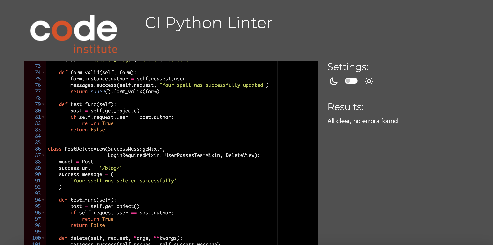 | No errors |

### Validation for users app:
| File:     | Screenshot:                       | Notes:  | 
|:----------|:--------------------------------------------------------------------------|:--------|
| admin.py  | 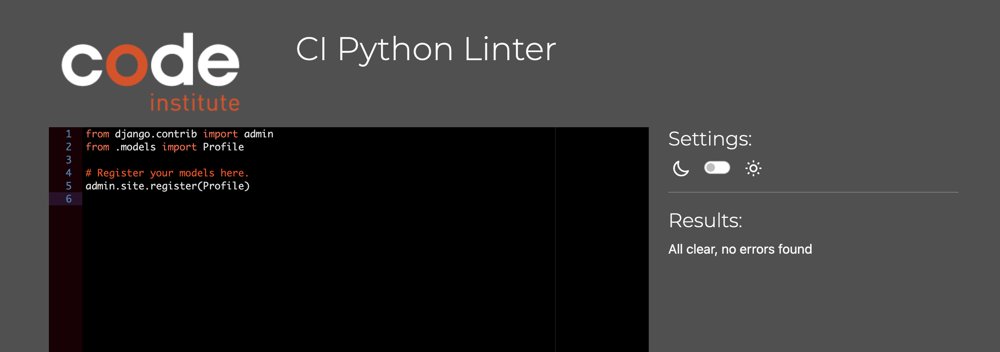 | No errors |
| apps.py | 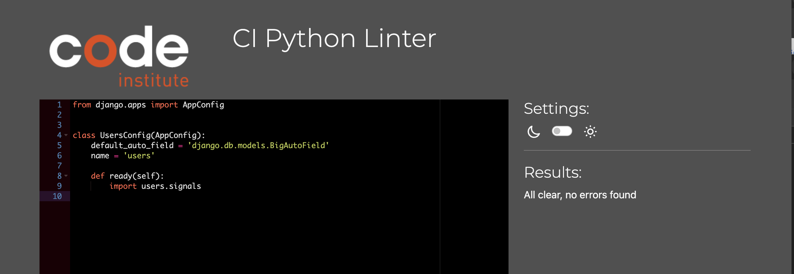 | No errors |
| forms.py | 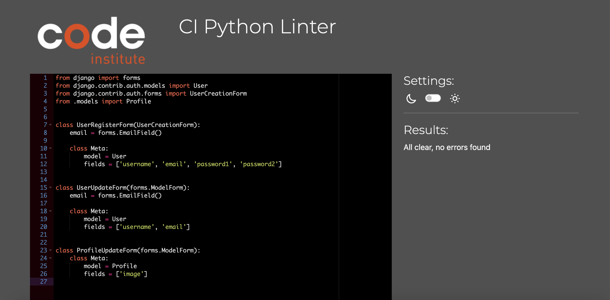 | No errors |
| models.py | 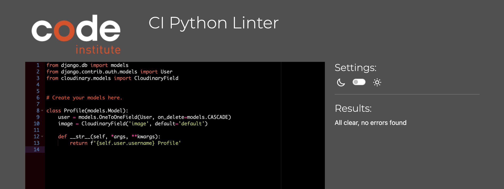 | No errors |
| signals.py | 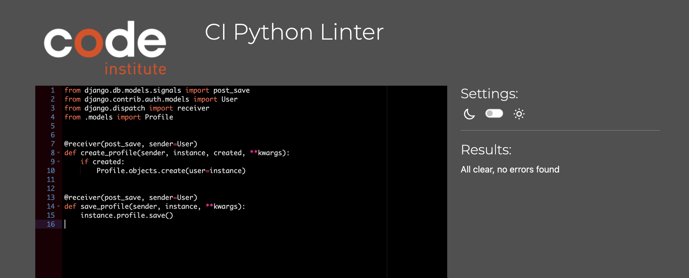 | No errors |
| urls.py |  | No errors |
| views.py | 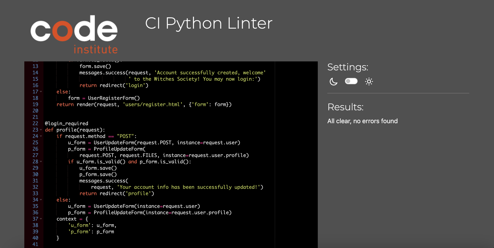 | No errors |

## Browser testing
| Browser:     | Screenshot:                       | Notes:  | 
|:----------|:------------------------------------------------------|:--------|
| Chrome | 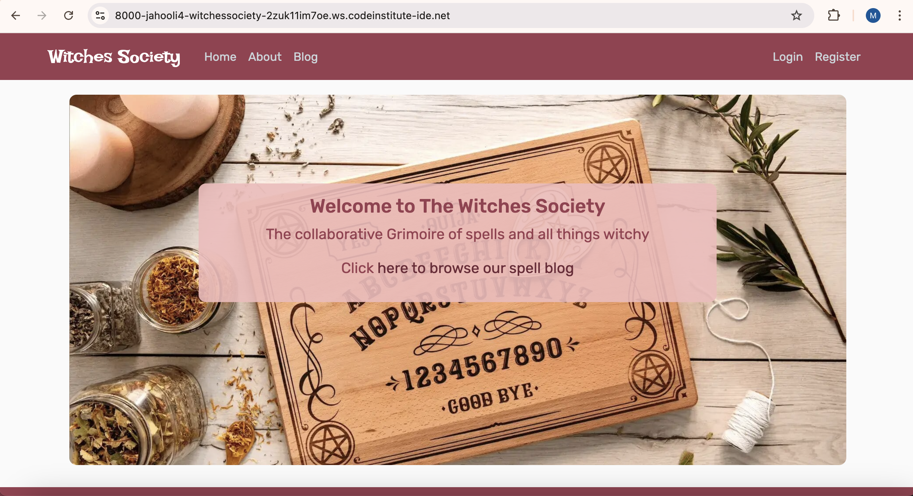 | No errors |
| Firefox |  | No errors |
| Safari |  | No errors |

## Bugs

### Incorrect post key:
<int:pk> post key number not as expected bc I had deleted posts previously. So url post/2 not post/1.

### Incorrect profile pictures showing
I had to use an if/else logic statement to ensure the correct image showed for the relevant profile.

### Terminal error preventing me from opening local port
A problem in the terminal said import wasn't being used so I deleted, env.py file was then not being imported so terminal error thrown. Replacing the code fixed the error.
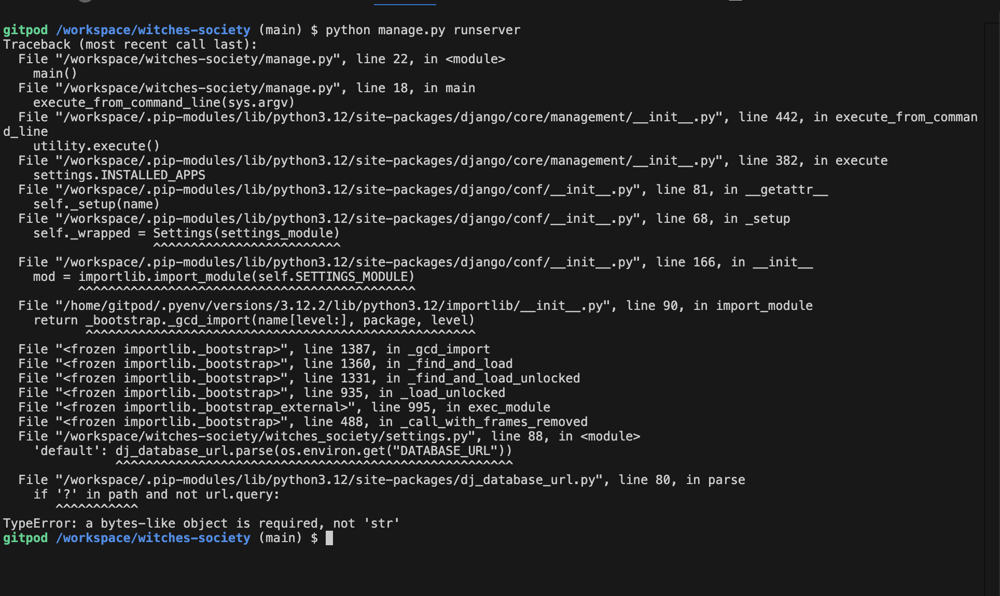
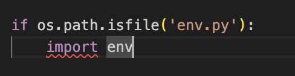

No unfixed bugs I am aware of.

## Languages Used:
- HTML used for the main site content.
- CSS used for the main site design and layout.
- JavaScript used for user interaction on the site.
- Python used as the back-end programming language.

## Technologies Used:
- Git used for version control. (git add, git commit, git push)
- GitHub used for secure online code storage.
- Gitpod used as a cloud-based IDE for development.
- Bootstrap used as the front-end framework for modern responsiveness and pre-built components.
- Django used as the Python framework for the site.
- PostgreSQL used as the relational database management.
- ElephantSQL used as the Postgres database.
- Heroku used for hosting the deployed site.
- Cloudinary used for online static file storage.
- Pillow used for image processing
- Gunicorn used for WSGI server
- Coolor: I used coolor.co to generate a colour palette.
- Font Awesome: was used to import icons into the footer for the social media links.
- Google Fonts: was used to customise the fonts of the site.
- amiresponsive: used to generate screenshots at beginning of readme.
